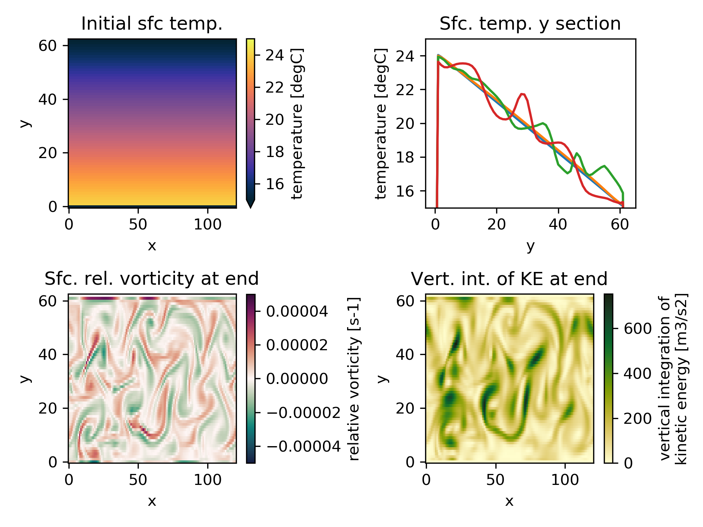

DW_CHANNEL
=======

This test case closely resembles the case in Danilov and Wang (2015, doi:10.1016/j.ocemod.2015.07.006). The grid is a re-entrant channel of 1800 km width and 3600 km length at 30 km resolution and flat bottom with 1600 m depth. The initial state is at rest with constant salinity and temperature gradients dT/dy = -5e-6 K/m and dT/dz = 8e-3 K/m. Initial noise on SSH is also added. A relaxation of temperature to the initial state is added within 165 km of the northern and southern boundary at a rate of 1e-6 s-1, corresponding to roughly 11 days. 

It serves as a benchmark for studying geostrophic turbulence in eddy-permitting models and can be used to e.g. evaluate viscosity and drag parameters. 

Contact: Joakim Kjellsson, joakimkjellsson@gmail.com

 

Top, left: First 5-day mean of temperature which is basically the initial state 
Top, right: Latitude sections of surface temperature after 5 days, 150 days, 250 days and 350 days. 
Lower, left: Surface relative vorticity after one year. 
Lower, right: Vertically integrated kinetic energy after one year. 

